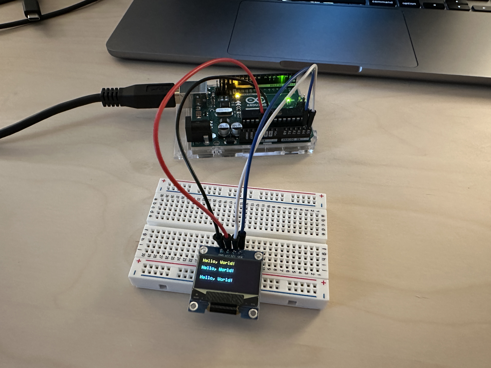
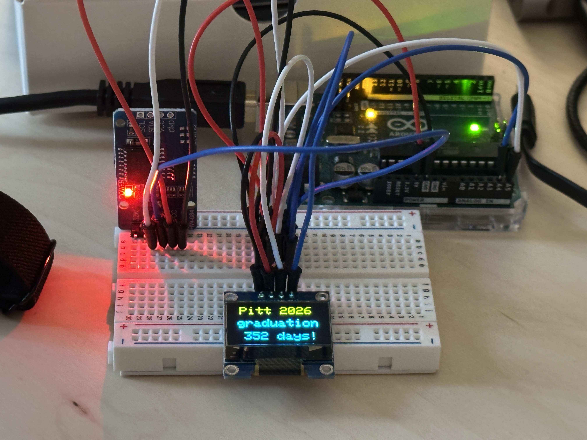
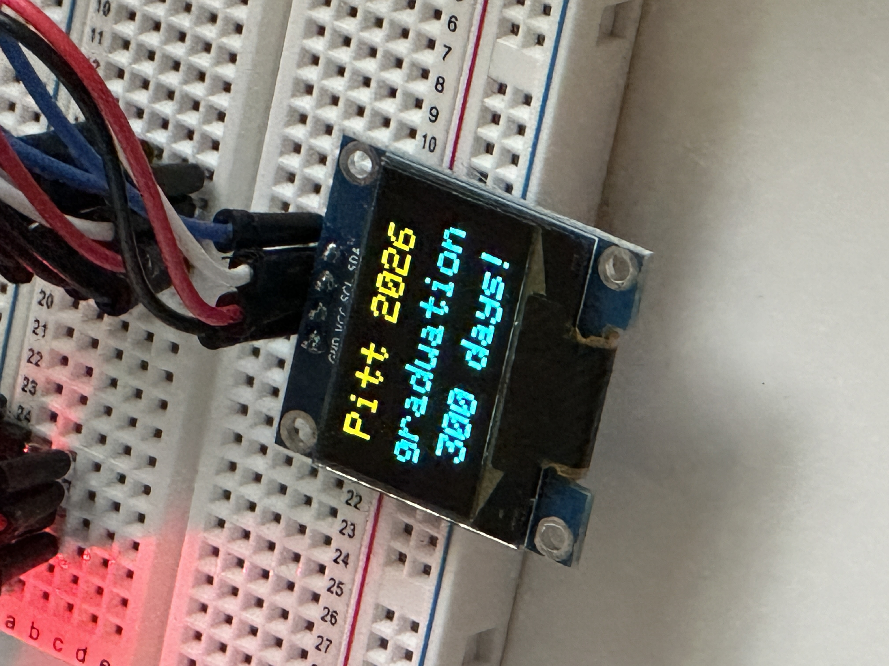

# Graduation Countdown Timer

A small Arduino project that counts down the days until graduation and shows the count on an OLED display. An onboard real-time clock keeps the date even when the Arduino is powered off, so the countdown stays accurate.

<p></p>
<p></p>
<p></p>

## How it works

A DS3231 real-time clock module tracks the current date and time. On every loop the Arduino reads the clock, subtracts it from the target date, and rounds up to a whole number of days (a partial day still counts as a day remaining). The result is drawn to a 0.96" SSD1306 OLED.

Both modules communicate over I²C and share the same two data lines, so the whole thing only needs four wires from the Arduino.

## Bill of materials

| Part | Notes | Link |
|------|-------|------|
| Arduino Uno REV3 | Any Uno / Uno-compatible board works | [Amazon](https://www.amazon.com/dp/B008GRTSV6) |
| DS3231 RTC module | Battery-backed real-time clock. The exact module I used is no longer listed — any DS3231 board (often sold as "ZS-042") works identically. | [Original (unavailable)](https://www.amazon.com/dp/B07V68443F) |
| 0.96" SSD1306 OLED | 128×64, I²C, two-color (yellow top / blue bottom) | [Amazon](https://www.amazon.com/dp/B072Q2X2LL) |
| Breadboard + jumper wires | I used the breadboard and male-to-male jumpers from this starter kit (~8 wires needed) | [Amazon](https://www.amazon.com/dp/B01ERP6WL4) |
| USB cable | To power and program the Arduino (Type-A to Type-B) | — |
| 9V power adapter *(optional)* | To run the project standalone without a computer | [Amazon](https://www.amazon.com/dp/B074BRR5YN) |

## Wiring

Both the RTC and the OLED sit on the same I²C bus, so they share the SDA and SCL lines. On an Arduino Uno, I²C is fixed to pins **A4 (SDA)** and **A5 (SCL)**.

| Signal | Arduino Uno | DS3231 RTC | SSD1306 OLED |
|--------|-------------|------------|--------------|
| Power | 5V | VCC | VCC |
| Ground | GND | GND | GND |
| Data (SDA) | A4 | SDA | SDA |
| Clock (SCL) | A5 | SCL | SCL |

Wire colors are just convention — this table is the source of truth. In the build photos, red/black run power and ground to the breadboard rails, and the white/blue wires carry the two I²C lines that both modules tap into.

## Build instructions

1. Wire everything according to the table above.
2. Install the required libraries through the Arduino IDE **Library Manager**:
   - `RTClib` (Adafruit)
   - `Adafruit GFX Library`
   - `Adafruit SSD1306`
   - `Wire` is built into the IDE — nothing to install.
3. Open the sketch and upload it to the Arduino over USB.
4. The first time it runs, the RTC sets its time from your computer's clock (the moment the sketch was compiled). After that, the coin cell on the RTC keeps time on its own.

## Notes

- **The two-tone text isn't done in software.** `setTextColor(WHITE)` only means "turn this pixel on." These cheap OLED panels are physically split — roughly the top 16 pixels are yellow and the rest is blue — so anything on the first line shows up yellow automatically. The "Pitt 2026" line lands in the yellow band by design.
- **Setting the target date.** Change the `targetDate` line in the sketch to your own date:
  ```cpp
  const DateTime targetDate(2026, 5, 3, 0, 0, 0);  // year, month, day, h, m, s
  ```
- **Ceiling division.** `(remaining.totalseconds() + 86399) / 86400` rounds up, so a partial day still reads as a full day remaining rather than dropping early.
- **Update rate.** The display refreshes once a minute (`delay(60000)`), which is plenty for a day counter and keeps it from flickering.

## License

MIT — see [LICENSE](LICENSE).